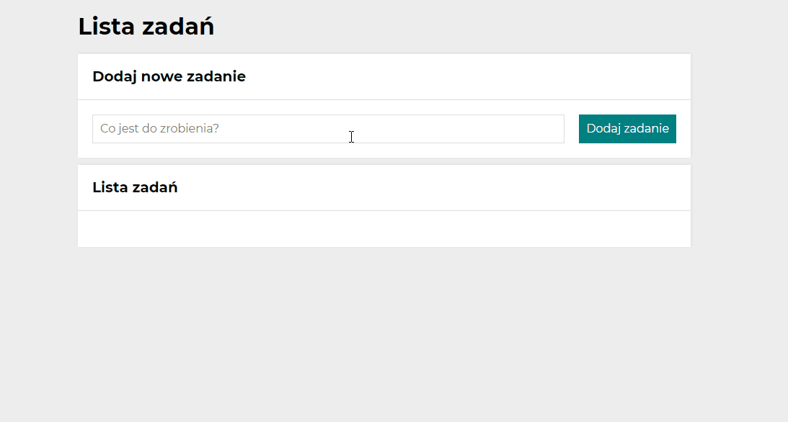

# To do list
This is the project of a simple "to do list" app. In this project I used object and arrays for the first time in my life.
## Demo
You can find a demo [here](https://paulgrym.github.io/to-do-list/).

## How to use
You can add as many tasks as you want (but one at the time) and they will be displayed below creating the list. Every task appears in a company of two buttons - green and red. By clicking the green one you can mark and unmark the task as done. Red button is for removing tasks from the list.  

## Technologies
- HTML
- CSS (Flex, Grid)
- JavaScript
- BEM convention
- MediaQueries
